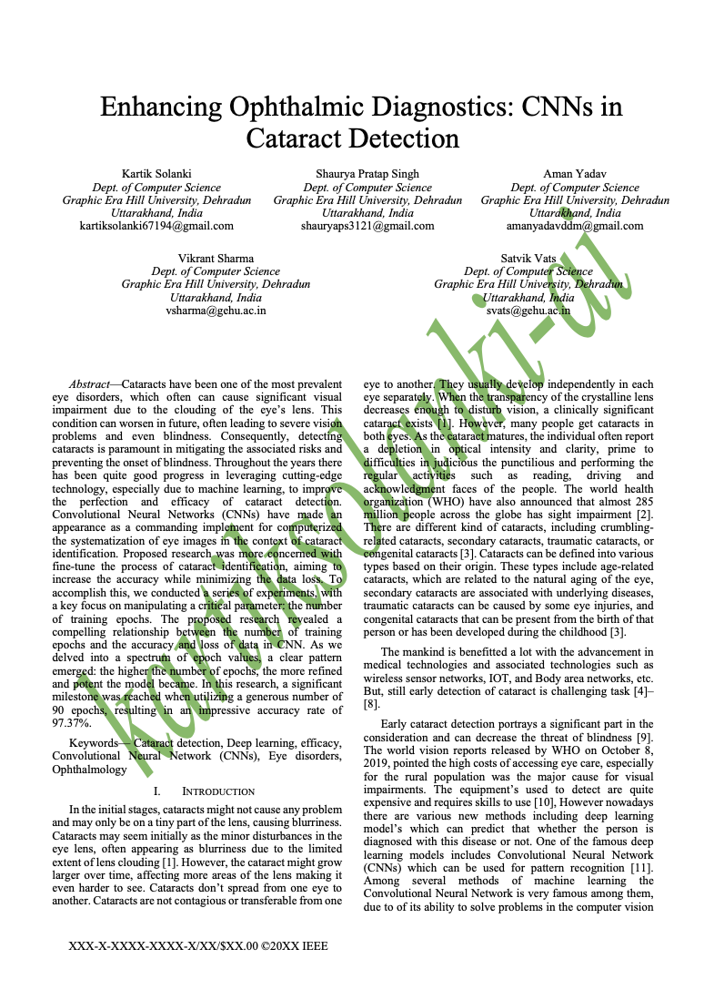
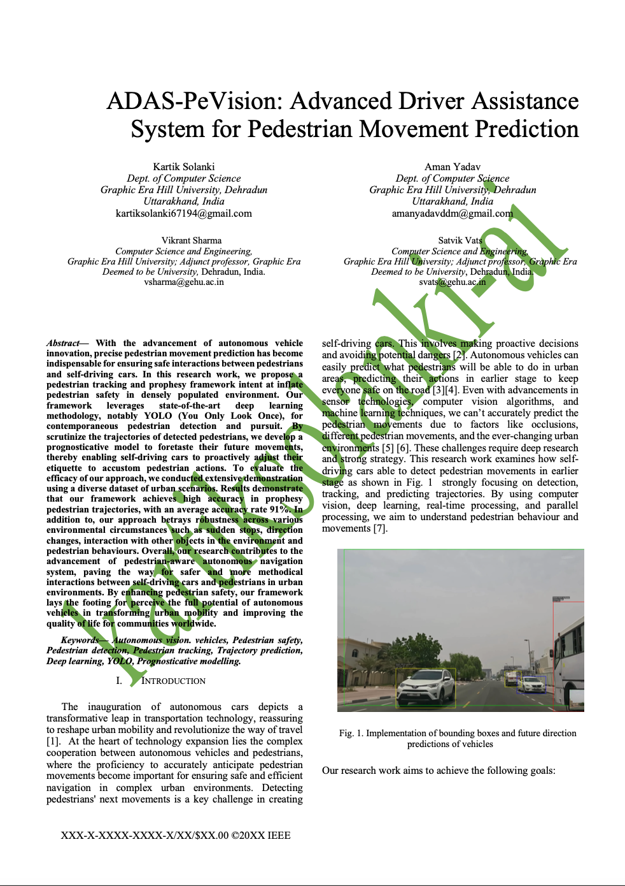

# Publications

This repository contains research papers and supporting materials from my recent publications, highlighting my work in AI/ML, computer vision.
Each publication includes a brief overview, abstract, and access to relevant code.

📝 Publications

1.Enhancing Ophthalmic Diagnostics: CNNs in Cataract Detection

Published in IEEE, 2024

Cataracts have been one of the most prevalent eye 
disorders, which often can cause significant visual impairment 
due to the clouding of the eye’s lens. This condition can worsen 
in future, often leading to severe vision problems and even 
blindness. Consequently, detecting cataracts is paramount in 
mitigating the associated risks and preventing the onset of 
blindness. Throughout the years there has been quite good 
progress in leveraging cutting-edge technology, especially due to 
machine learning, to improve the perfection and efficiency of
cataract detection. Convolutional Neural Networks (CNNs) 
have made an appearance as a commanding implement for 
computerized the systematization of eye images.

IEEE Explore link: https://ieeexplore.ieee.org/document/10489576

2.ADAS-PeVision: Advanced Driver Assistance System for Pedestrian Movement Prediction

Published in IEEE, 2025

With the advancement of autonomous vehicle
innovation, precise pedestrian movement prediction has become
indispensable for ensuring safe interactions between pedestrians
and self-driving cars. In this research work, we propose a
pedestrian tracking and prophesy framework intent at inflate
pedestrian safety in densely populated environment. Our
framework leverages state-of-the-art deep learning
methodology, notably YOLO (You Only Look Once), for
contemporaneous pedestrian detection and pursuit. By
scrutinize the trajectories of detected pedestrians, we develop a
prognosticative model to foretaste their future movements,
thereby enabling self-driving cars to proactively adjust their
etiquette to accustom pedestrian actions. 

IEEE Explore link: https://ieeexplore.ieee.org/document/19873422
